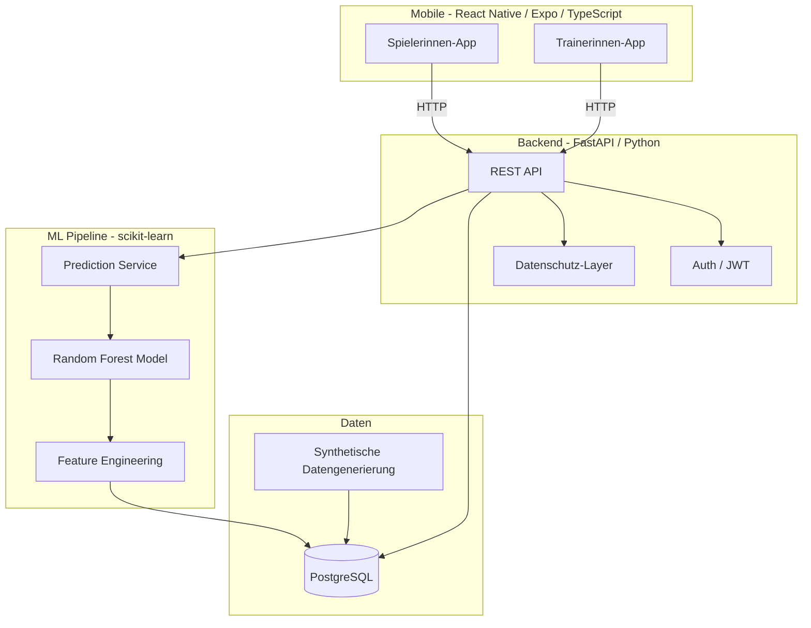

# Cycle-Aware Load Monitoring – Detaillierte Task-Liste

## Architekturübersicht




---

## Phase 0: Projekt-Setup

- **0.1** Projektstruktur anlegen (Monorepo):

```
  kip/
  ├── backend/
  │   ├── app/
  │   │   ├── main.py
  │   │   ├── models/
  │   │   ├── schemas/
  │   │   ├── routers/
  │   │   ├── services/
  │   │   └── ml/
  │   ├── tests/
  │   ├── requirements.txt
  │   └── Dockerfile
  ├── mobile-player/
  │   ├── app/
  │   ├── package.json
  │   └── app.json
  ├── mobile-coach/
  │   ├── app/
  │   ├── package.json
  │   └── app.json
  ├── data/
  │   └── synthetic/
  ├── docker-compose.yml
  ├── .gitignore
  ├── .env.example
  └── README.md
  

```

- **0.2** `.gitignore` erstellen (Python, Node, .env, **pycache**, node_modules, .venv)
- **0.3** `docker-compose.yml` mit Services: `db` (PostgreSQL), `backend` (FastAPI)
- **0.4** Backend-Grundgerüst: FastAPI-App mit Health-Check-Endpoint, `requirements.txt` (fastapi, uvicorn, sqlalchemy, alembic, psycopg2-binary, pydantic, python-jose, passlib, bcrypt, scikit-learn, pandas, numpy)
- **0.5** Mobile-Grundgerüst: React Native + Expo + TypeScript initialisieren (`mobile-player/`, `mobile-coach/`)
- **0.6** README.md mit Setup-Anleitung (Docker Compose), Projektbeschreibung, Tech-Stack

---

## Phase 1: Datenbankmodell und Migrationen

- **1.1** SQLAlchemy-Modelle definieren in `backend/app/models/`:
  - `User` (id, email, password_hash, role [player/coach], team_id, name, created_at)
  - `Team` (id, name, created_at)
  - `CycleEntry` (id, player_id, date, cycle_day, phase [menstruation/follicular/ovulation/luteal], cycle_length, pms_score, cramps, migraine, fatigue, contraception_type, notes)
  - `WellnessEntry` (id, player_id, date, sleep_hours, sleep_quality, muscle_soreness, mental_energy, stress_level, motivation, rpe_previous_day, free_text)
  - `TrainingEntry` (id, player_id, date, duration_min, intensity, jump_count, sprint_times, strength_values, match_stats)
  - `InjuryEntry` (id, player_id, date, body_location, pain_intensity, is_chronic, description)
  - `PrivacyConsent` (id, player_id, coach_id, share_cycle_data, share_wellness_data, created_at, updated_at)
  - `PushDevice` (id, user_id, device_token, platform [ios/android], is_active, last_seen_at)
  - `RiskPrediction` (id, player_id, date, risk_score, risk_level [green/yellow/red], model_version, features_used)
- **1.2** Alembic einrichten und initiale Migration erstellen
- **1.3** Datenbank-Session und Dependency Injection in FastAPI konfigurieren
- **1.4** Begriffskonsistenz festlegen: API-Rollen als `player/coach`, UI-Texte als "Spielerin/Trainerin"

---

## Phase 2: Authentifizierung und Benutzerverwaltung

- **2.1** Pydantic-Schemas: `UserCreate`, `UserLogin`, `UserResponse`, `TokenResponse`
- **2.2** Auth-Service: Passwort-Hashing (bcrypt), JWT-Token-Erstellung und -Validierung
- **2.3** API-Routen (`backend/app/routers/auth.py`):
  - `POST /api/auth/register` – Registrierung (Spielerin oder Trainerin)
  - `POST /api/auth/login` – Login, gibt JWT zurück
  - `POST /api/auth/refresh` – Erneuert Access-Token via Refresh-Token
  - `POST /api/auth/logout` – Invalidiert Refresh-Token / Session
  - `GET /api/auth/me` – Aktueller User
- **2.4** Middleware / Dependency: `get_current_user` zur JWT-Validierung
- **2.5** Rollenbasierte Zugriffskontrolle: Decorator/Dependency `require_role("coach")` bzw. `require_role("player")`
- **2.6** Mobile Security: Token-Handling für Apps (Access-Token kurzlebig, Refresh-Token; Speicherung im Secure Store/Keychain)
- **2.7** Tests: Registrierung, Login, Refresh, Logout, ungültiger Token, Rollenbeschränkungen

---

## Phase 3: Core API-Endpoints (CRUD)

- **3.1** Wellness-Endpoints (`backend/app/routers/wellness.py`):
  - `POST /api/wellness/` – Täglichen Check eintragen
  - `GET /api/wellness/` – Eigene Einträge abrufen (mit Datumsfilter)
  - `GET /api/wellness/{player_id}` – Trainerin ruft Daten ab (Privacy-Check!)
- **3.2** Zyklus-Endpoints (`backend/app/routers/cycle.py`):
  - `POST /api/cycle/` – Zykluseintrag erstellen
  - `GET /api/cycle/` – Eigene Zyklusdaten
  - `GET /api/cycle/{player_id}` – Nur wenn `PrivacyConsent.share_cycle_data == True`
- **3.3** Training-Endpoints (`backend/app/routers/training.py`):
  - `POST /api/training/` – Trainingseinheit erfassen
  - `GET /api/training/` – Eigene Daten
  - `GET /api/training/{player_id}` – Für Trainerin
- **3.4** Injury-Endpoints (`backend/app/routers/injury.py`):
  - `POST /api/injury/` – Schmerz/Verletzung melden
  - `GET /api/injury/` – Eigene Einträge
- **3.5** Privacy-Endpoints (`backend/app/routers/privacy.py`):
  - `PUT /api/privacy/consent` – Spielerin setzt Freigaben
  - `GET /api/privacy/consent` – Aktuelle Einstellungen abrufen
- **3.6** Datenschutz-Service: Zentrale Logik, die bei jedem Trainer-Zugriff prüft, ob die Spielerin die Daten freigegeben hat
- **3.7** Tests für jeden Endpoint: Happy Path, Validierung, Zugriffskontrolle

---

## Phase 4: Synthetische Datengenerierung

- **4.1** Script `backend/app/data_generation/generate.py`:
  - 15-20 synthetische Spielerinnen generieren
  - Pro Spielerin 90-180 Tage Daten
- **4.2** Realistische Zyklusdaten:
  - Zykluslänge 26-32 Tage (normalverteilt)
  - Phasen korrekt berechnen (Menstruation ~5d, Follikelphase ~7d, Ovulation ~3d, Lutealphase ~14d)
  - PMS-Symptome korreliert mit Lutealphase
- **4.3** Wellness-Daten mit biologisch plausiblen Korrelationen:
  - Schlafqualität beeinflusst mentale Energie
  - Zyklusphase beeinflusst Muskelkater und Müdigkeit
  - Trainingsintensität des Vortags beeinflusst RPE
- **4.4** Trainings-Daten:
  - Wochenrhythmus (Mo-Sa Training, So frei)
  - Periodisierung (Belastungswochen + Erholungswochen)
- **4.5** Verletzungs-Daten:
  - Erhöhte Wahrscheinlichkeit bei hohem ACWR oder in bestimmten Zyklusphasen
- **4.6** Seed-Script zum Befüllen der Datenbank (`python -m app.data_generation.seed`)

---

## Phase 5: Feature Engineering und ML-Pipeline (präzise Modelldefinition)

- **5.1** Feature-Engineering-Modul (`backend/app/ml/features.py`):
  - **ACWR** (Acute:Chronic Workload Ratio) – 7-Tage vs. 28-Tage rolling average
  - **Zyklusphase** als kategorische Variable (One-Hot-Encoding)
  - **Rolling Averages** für Wellness-Scores (3d, 7d)
  - **Deltas** (Veränderungen gegenüber Vortag)
  - **Interaktionsfeatures**: Zyklusphase x Trainingsintensität, Schlaf x mentale Energie
  - **Aggregierte Symptom-Scores**
- **5.2** Zielvariable und Labeling (`backend/app/ml/labeling.py`):
  - Primärziel: Binary Classification `overload_risk_3d` (Risiko in den nächsten 3 Tagen)
  - Label-Regeln dokumentieren: hohe subjektive Belastung, Lastsprung (ACWR), trainingsrelevante Beschwerde
  - Leakage-Checks: Nur Informationen bis Zeitpunkt `t` verwenden
- **5.3** Training-Pipeline (`backend/app/ml/train.py`):
  - Daten aus DB laden und Features berechnen
  - Zeitbasierte Validierung (Walk-Forward), kein zufälliger Split
  - Modellvergleich: Regelbasiert (ACWR), Logistische Regression, Random Forest/Gradient Boosting
  - Metriken loggen: PR-AUC, Recall, ROC-AUC, F1, Brier Score
  - Modell serialisieren (joblib) nach `backend/app/ml/models/`
- **5.4** Prediction-Service (`backend/app/ml/predict.py`):
  - Modell laden
  - Aktuelle Features für eine Spielerin berechnen
  - Wahrscheinlichkeit `p(risk)` und Risiko-Level zurückgeben
  - Ampellogik: Grün `<0.35`, Gelb `0.35-0.64`, Rot `>=0.65`
- **5.5** API-Endpoint: `GET /api/predictions/{player_id}` – Aktuelle Vorhersage
- **5.6** API-Endpoint: `GET /api/predictions/team` – Alle Spielerinnen (für Trainerinnen-App)
- **5.7** Explainability: Feature Importance + optionale SHAP-Werte für Coach-Feedback
- **5.8** Tests: Feature-Berechnung (ACWR korrekt?), Labeling-Regeln, Prediction-Format, Schwellen-Mapping

---

## Phase 6: Mobile – Spielerinnen-App

- **6.1** Navigation einrichten (React Navigation): Login, Dashboard, Wellness-Check, Zyklus, Verletzung, Einstellungen
- **6.2** Auth-Kontext: Login/Logout, JWT im Secure Store, geschützte Screens
- **6.3** Login- und Registrierungsseite
- **6.4** **Wellness-Check-Formular** (Kernseite):
  - Slider/Skalen für alle Werte (1-10)
  - Schlafstunden als Zahleneingabe
  - Optionales Freitextfeld
  - Kompakt und in unter 90 Sekunden ausfüllbar
- **6.5** **Zyklus-Tracking-Seite**:
  - Zyklusstart markieren
  - Aktuelle Phase anzeigen (automatisch berechnet)
  - Symptome erfassen (PMS, Krämpfe, Migräne, Müdigkeit)
- **6.6** **Verletzungs-/Schmerzseite**:
  - Schmerzintensität (Skala)
  - Körperteil-Auswahl (Dropdown oder einfache Auswahl)
  - Beschreibungsfeld
- **6.7** **Persönliches Dashboard (Spielerin)**:
  - Letzte Einträge anzeigen
  - Eigener aktueller Risiko-Score (Ampel)
  - Trend der letzten 7 Tage (einfaches Liniendiagramm)
- **6.8** **Datenschutz-Einstellungen**:
  - Toggles: Zyklusdaten teilen (ja/nein), Wellnessdaten teilen (ja/nein)
- **6.9** API-Service-Layer mit fetch/axios und JWT-Header
- **6.10** Push-Reminder für Daily Check-in (optional im MVP, fix im Post-MVP)

---

## Phase 7: Mobile – Trainerinnen-App

- **7.1** **Team-Übersicht**:
  - Liste aller Spielerinnen mit Ampel-Icon (Grün/Gelb/Rot)
  - Sortierbar nach Risiko-Score
- **7.2** **Spielerinnen-Detailansicht**:
  - Wellness-Verlauf (Liniendiagramm, z. B. mit victory-native)
  - Trainingsbelastung-Verlauf
  - Zyklusdaten (nur wenn freigegeben, sonst Hinweis "nicht freigegeben")
  - Verletzungshistorie
- **7.3** **Team-Trend-Ansicht**:
  - Durchschnittliche Wellness-Werte des Teams
  - Anzahl Spielerinnen pro Risiko-Level

---

## Phase 8: Integration, Docker und Deployment

- **8.1** `Dockerfile` Backend (Python, uvicorn)
- **8.2** Build-Profile für mobile Apps (Expo EAS / lokale Builds) dokumentieren
- **8.3** `docker-compose.yml` finalisieren (DB, Backend, Volumes, Networks)
- **8.4** `.env.example` mit allen benötigten Umgebungsvariablen (DB-URL, JWT-Secret, etc.)
- **8.5** End-to-End-Test: Kompletter Flow (Registrieren -> Login -> Wellness eintragen -> Risiko prüfen)
- **8.6** README.md finalisieren: Setup mit einem Befehl (`docker compose up`), Screenshots, API-Doku

---

## Phase 9: Qualitätssicherung und Feinschliff

- **9.1** Linter und Formatter einrichten (Backend: ruff/black, Mobile: ESLint/Prettier)
- **9.2** Alle Tests durchlaufen lassen, Coverage prüfen
- **9.3** Commit-History aufräumen (sinnvolle Messages)
- **9.4** Sicherheits-Check: Keine Secrets im Code, .env in .gitignore, SQL-Injection-Schutz durch SQLAlchemy
- **9.5** UI-Feinschliff: Mobile UX, Loading States, Error Handling

